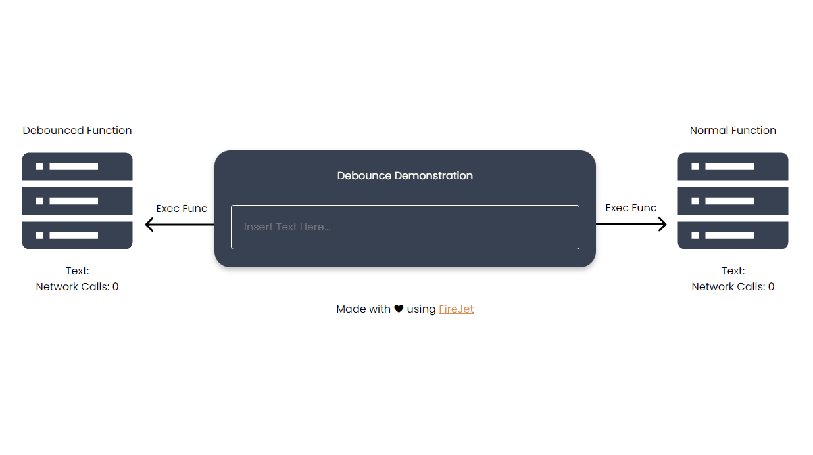

# React debounce sample

The use debounce hook can be found in `src/helpers/useDebounce.tsx`

## Demo

## Overview

The frontend was exported directly from Figma using [FireJet](https://www.firejet.io)

The main logic for the sample can be found in `App.tsx`

## Available Scripts

In the project directory, you can run:

### `yarn start`

Runs the app in the development mode.\
Open [http://localhost:3000](http://localhost:3000) to view it in the browser.

The page will reload if you make edits.\
You will also see any lint errors in the console.